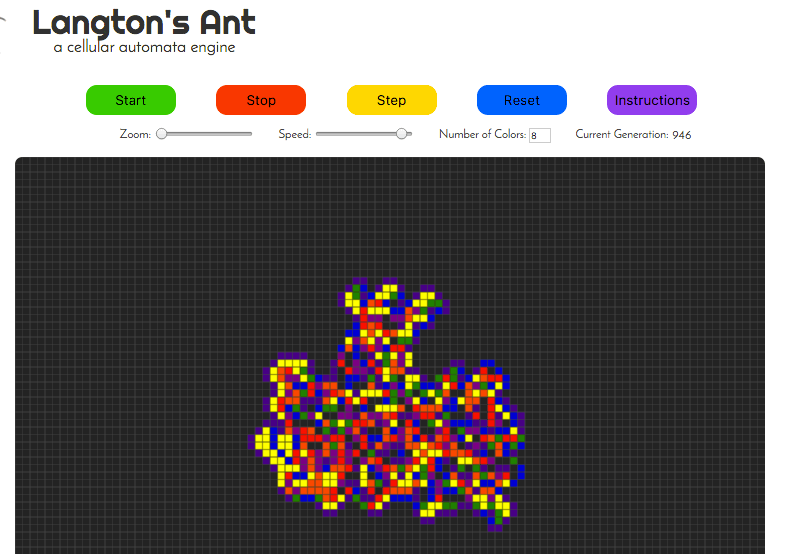

# Langton's Ant

## Background

Langton's Ant is a cellular automaton that was created in 1986 by mathematician Chris Langton.  The idea behind this automaton is simple: an "ant" is traveling along a grid of squares colored either white or black.  The ant's movements follow these two rules:

- If the square is white, the ant turns 90&deg; left, changes the square's color to black, and moves forward one square.
- If the square is black, the ant turns 90&deg; right, changes the square's color to white, and moves forward one square.  

That's it.  The resulting grid looks something like this:

A lot of interesting mathematical stuff is known about Langton's Ant.  A good place to start is the [Wikipedia page](https://en.wikipedia.org/wiki/Langton%27s_ant).

## Generalizations

Many generalizations of this idea are out there.  This engine uses two:

- Multiple ants: this engine can handle an arbitrary number of ants (stored in an array in the game's board class).  If two ants happen upon the same square in the same generation of the game, they will perform their changes to that square in the order the ants were created.  

- Multiple colors: this engine can produce squares in up to 8 colors.  On the back end, these colors are stored in an array, `this.colors`.  When the ant encounters a square, it looks at the index `i` of that square's color in `this.colors`.  It increments that index by one, and changes the square's color to `this.colors[i+1]`, wrapping around to `this.colors[0]` when necessary.

Here's what these features look like in action:

## Using This Engine

The controls for this engine are straightforward.  

- To add ants, click on a square in the grid.  You can add ants while the game is paused or running.
- Hit the `Start` button to get the ants moving.  Ants will move according to the rules defined in the Background section.  If you haven't placed any ants before you hit `Start`, a single ant will be added for you in the middle of the board.
- Hit `Stop` to pause the game, but retain the current state of the game.
- Hit `Reset` to clear the board.  
- Hit `Step` to initiate a single step forward in the ants' movement.
- The `Zoom` bar will zoom in on the center of the board.  
- The `Number of Colors` box will increase the number of colors being used.  If you hit this while the game is running, the ants will incorporate the new colors into the changes without changing any colors on the current board.  
- The `Speed` bar will decrease and increase the time between generations.  The engine can go as fast as 1 generation every 10 milliseconds.  

## Directions for Improvement

The beauty of Langton's Ant is the multitude of ways in which it can be tweaked and generalized.  Here are some plans I have for the future:

- Create some more sophisticated logic for ant "collisions", perhaps be creating a new ant out of collision and/or changing the direction choice in this case.
- Tweaking the zoom so that the user can observe what's happening on a larger scale.  
- Adding more rules for movement, depending on color.  Right now, the colors with even indices in `this.colors` trigger a left turn, and those with odd indices trigger a right turn.  It would interesting to customize the rules for each of the individual colors.  
