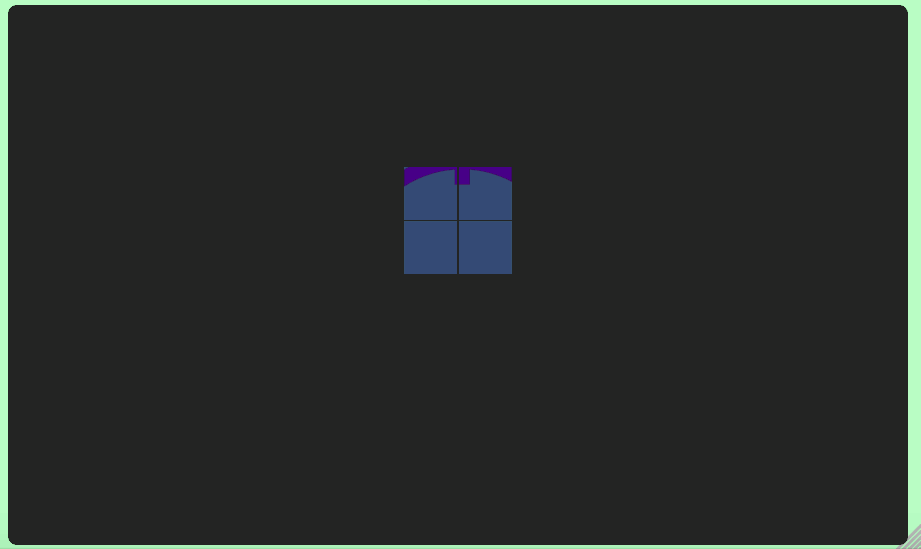

# Langton's Ant

## Background

Langton's Ant is a cellular automaton that was created in 1986 by mathematician Chris Langton.  The idea behind this automaton is simple: an "ant" is traveling along a grid of squares colored either white or black.  The ant's movements follow these two rules:

- If the square is white, the ant turns 90&deg; left, changes the square's color to black, and moves forward one square.
- If the square is black, the ant turns 90&deg; right, changes the square's color to white, and moves forward one square.  

That's it.  The resulting grid looks something like this:

A lot of interesting mathematical stuff is known about Langton's Ant.  A good place to start is the [Wikipedia page](https://en.wikipedia.org/wiki/Langton%27s_ant).

## Generalizations

Many generalizations of this idea are out there.  This engine uses two:

- Multiple ants: this engine can handle an arbitrary number of ants (stored in an array in the game's board class).  If two ants happen upon the same square in the same generation of the game, they will perform their changes to that square in the order the ants were created.  

- Multiple colors: this engine can produce squares in up to 8 colors.  On the back end, these colors are stored in an array.  When the ant encounters a square, it looks at the index of that square's color in the color array.  It increments that index by one, and changes the square's color to the color found at that
